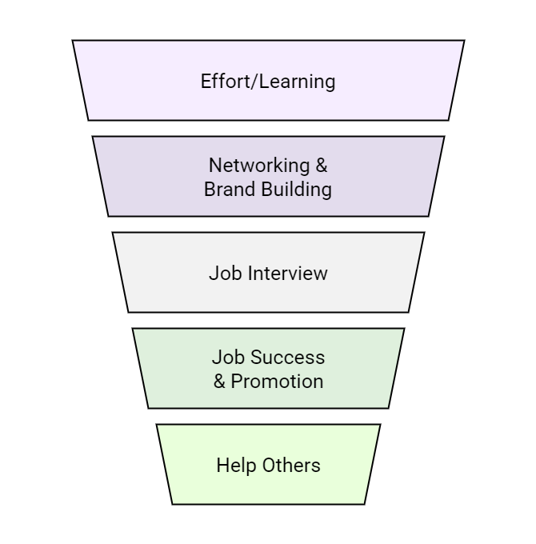

# 8. KPIs and Experimentation

## 8-2. Leading vs Lagging Metrics

Meaningful metrics should (almost always) be linked to some amount of reduced cost or increased revenue - the base metrics of business success. Revenue metrics often move slowly due to a lot of user interaction, product engagement, and funnel progression needs to happen before revenue is realized.

Are we measuring inputs or outputs? Does our effect impact our output?

- Leading metrics are input-oriented. These are measure of activities or processes that predict future performance. Leading metrics are typically easier and faster to influence and measure and are often used for detecting trends early.

- Lagging metrics are output-oriented. These measure the culmination of outcomes from past actions and processes. These are typically your core business objectives like total revenue or customer lifetime value. These are historical, and slower to react, you must wait longer to observe lagging metrics than you do leading metrics.

Are inputs and outputs correlated? E.g. conversion rate

- Don't just pick an input metric, you need to ensure there's a demonstratable correlation between your chosen leading metric and desired (lagging) business outcome. Without this correlation, you can't know which inputs to optimize.

- Example on conversion rate. In an e-commerce context, a conversion rate (e.g. engagement leading to purchase) is a leading indicator for revenue. If you increase your conversion rate, it's highly likely that your revenue will increase (assuming other factors remain constant). 

### Beyond product analytics (working example)
This example focuses on an individual's career development rather than traditional product analysis and demonstrates the concepts of leading and lagging metrics.

1. Leading metric: Hours spent practicing SQL
    - This is an input that you control. Although, it doesn't immediately get you a job, it's strongly linked to future success in data engineering interviews and roles.
    
2. Lagging metric: Number of job offers received
    - This is the output, which is built on various inputs, your SQL skills, resume, interview performance, networking, etc. 
    - It happens after weeks/months of daily SQL practice.

3. Extreme lagging metric might be "how many students get better jobs from what I taught them"
    - This outcome takes a very long to become observable. It's difficult to measure directly and requires long-term tracking. 
    - This is an example of an _ultimate_ business outcome which can be very delayed and have complex relationships with inputs.

4. Conversion rate might be “hours applying divided by job interviews”
    - This is an example of a ratio metric, measuring the efficiency of your job application process. Think of this as the number of hours of effort it takes to convert into a desired outcome (interviews).
    - Improving this conversion rate (e.g. by more targeted job applications) is a leading indicator for receiving more job offers (the lagging metric).

### Learning/Job Funnel
Here we discuss the data engineer's career journey using a Funnel framework (shown in Figure 1).

  

<em>Figure 1: Visual representation of the Learning/Job Funnel.</em>

1. Effort/learning: what should I learn and how should I learn it?
    - The focus should be on mastering core skills and understanding foundational methodologies
    - Be careful not to get stuck in "tutorial hell"
    - Don't spread your learning too broad, and make sure you get a deep understanding in a few key areas.
    - Don't skip networking, even at this early stage.
    
2. Brand building/networking: How should I market my learned skills? who should I network with?
    - The focus should be on strategically showcasing skills, building a professional presence, and make valuable connections.
    - Don't limit yourself by only applying to jobs that you meet 100% of requirements. 
    - Don't rely solely on applications, leverage the power of personal connections to get referrals.

3. Job interview: where should I apply? Where will increase my skills most?
    - The focus should be on understanding hiring processes and demonstrating readiness.
    - Make sure to ask questions in interviews. If you don't you'll struggle to identify companies/teams that are a poor fit.
    - Don't accept unsupportive managers. Keep track of red and green flags regarding management styles and team environments that may hinder your development.

4. Success/promotion: How do I keep providing value? How do I take my job to the next level?
    - The focus should be on consistently delivering impact, seeking opportunities for growth and strategically positioning yourself.
    - Don't stay in a toxic job just for the pay. It's a balance between financial needs and not getting burnt out or stagnating.
    - Be generous with your time. Engage in mentorship, team improvement, and knowledge sharing.

5. Help others: how do I effectively teach my mentees?
    - The focus should be on scaling out. Transition into leadership through mentoring, coaching, and contributing to the community.
    - Make sure you're actively seeking mentees, put yourself out there so you don't miss opportunities.
    - Don't settle for one-way mentorship. Embrace learning from mentees and adapting teaching styles to their needs to maximize the value of your mentorship.
    - Don't get caught up in the mindset of hoarding knowledge. Sharing exclusive knowledge build collective strength and individual influence.

### The Archetypal Business Funnel
The business funnel is the blueprint of your product user's journey, from initial awareness through to becoming a loyal user. Every stage of the funnel generates data that needs to be collected, modeled and analyzed to influence business decisions and create impact.

**Stages of the Business Funnel:**
1. Impressions (channel tracking, cost per click, etc.): Where potential users first become aware of your product or service.
    * Ingest data from advertising platforms so you can track impressions and engagement so you can attribute traffic correctly.

2. Sign-ups/Email Acquisition (landing page, page speed): Where initial interest converts into a lead or user registration.
    * Capture events related to landing page views, form submissions, successful sign-ups and page speed metrics that can directly impact conversions rates.
    * This let's you build data models to support A/B testing on these elements.

3. Purchase (pricing structure and pricing page): The moment a user becomes a customer.
    * Track conversion rates from sign-up to purchase and average order value so you can explore different pricing structures and analyze how demand changes with price (elasticity).

4. Engaged/Retained (Onboarding, Notifications, Schedule, Content): Keep customers active and deriving value from the product over time.
    * Track engagement metrics (active users, feature usage), retention rates, and analye the effectiveness of onboarding flows, content consumption patterns and notifications.

5. Referral/Testimonial (notifications, incentive, LTV): Turn satisfied customers into advocates who bring in new users.
    * Track referral program effectiveness, testimonial generation, and calculate customer lifetime value (LTV).
    * Think about how to link customer acquisition costs to their long-term revenue generation.

If an activity doesn’t fit into this funnel, it’s potentially a waste of time. Thinking about this business funnel in your data engineering work will improve your story telling and make you more impactful.
    
### How to think like a PM
As a data engineer, embracing a product manager's mindset is crucial for building impactful data solutions. You need to move beyond thinking in terms of pipelines and instead think about connecting data to user experience and business value.

> Empathize with the user's journey and identify their moments of delight and frustration.

Through every step of the funnel, ask: “what’s sparking joy or pain?”
* Analyze each stage of the user journey (or funnel) from the user's emotional and functional perspective. Don't just count actions, understand the quality of those interactions.

Examples across a Bootcamp Funnel:

1. Initial Engagement/Discovery Phase:
    * Joy: Students are happy when they discover many informative social media content that aligns with their interests and personal goals.
    * Pain: Students might feel a loss of connection once they leave the social media platform.
    * PM Thinking: Identify the user's desire for deeper connection. 
    * DE Contribution: Track newsletter sign-up rates or direct communication engagement (e.g., open rates or click-throughs) as a sign of this "closed connection," indicating joy and engagement.

2. Enrolment/Onboarding Phase:
    * Joy: Students are happy when they encounter a large collection of valuable learning content.
    * Pain: After purchasing, student encounter delays in getting added to essential platforms like GitHub or Discord. This cause frustration and can lead to early churn or negative sentiment.
    * PM Thinking: Prioritize reducing these delays.
    * DE contribution: Build pipelines to monitor onboarding completion rates, time-to-first-access for content, and time-to-join for platforms, to quantify the pain.

3. Learning/Community Engagement Phase:
    * Joy: Students are happy when put into groups and assigned a mentor, it gives them a sense of community, support, and motivation for keeping engaged.
    * Pain: Students feel overwhelmed by the intensity or pace of the bootcamp. This can lead to disengagement and drop-offs if not addressed.
    * PM Thinking: Think about optimizing group sizes or mentor assigment processes along with modules completion rates.
    * DE contribution: Track group activity levels, mentor-mentee interactions, and potentially sentiment analysis on forum posts. 
    
4. Outcome/Success Phase:
    * Joy: Students are happy when they land a better job because of the skills they gained in the bootcamp. 
    * Pain: Students struggling to convert what they've learnt into a new job or promotion.
    * PM Thinking: Focus on job placement rates and long-term career success.
    * DE Contribution: Build systems and channels to track job placement, salary increases, and referall rates from alumni to quantify the ultimate joy delivered. 
